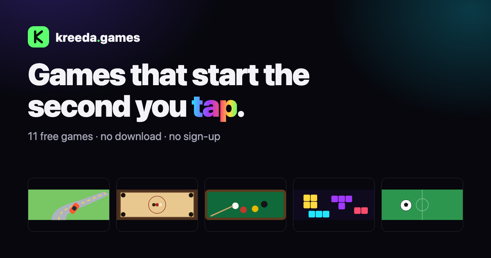

# Kreeda — Browser Games

[](https://kreeda.games)

[**Play now at kreeda.games →**](https://kreeda.games)

A collection of polished, single-file browser games. No build tools, no frameworks, no dependencies — every game is a single `index.html` you can open straight from the file system or host as a static site.

Open [`index.html`](index.html) at the repo root for the [Kreeda](https://kreeda.games) landing page — a card grid linking to every game (this is what's live at kreeda.games via GitHub Pages).

## Games

| Game | Description | Play |
|---|---|---|
| [Drift](drift/index.html) | A bright, sunny endless drifting game with a **real throttle and brake** — no handbrake. Slides aren't a button: steering yaws the car, the velocity vector chases the heading, and that chase is capped by a lateral grip budget, so carrying too much speed into a corner is what breaks the tail loose. Brake as you turn in and the weight shifts onto the nose, unloading the rear; get back on the power to hold it, and countersteer to catch it. **The battery is your life.** You drive a high-end EV: a barrier no longer kills you, it bites a chunk out of the pack and scrubs your speed; wandering off into the grass drains it fast; landing a drift chain claws charge back — so driving well is what buys you a longer run, and the run ends at 0% (`OUT OF CHARGE`). Need to stop? **PAUSE** (or Esc) doesn't freeze the world — the car pulls itself off at the next rest area (or the hard shoulder, if none's in reach), and every services is a real facility: a broad, trumpet-mouthed exit road where the car automatically drops to **10 km/h**, a big set-back parking lot, and a row of well-spaced DC fast-charge **kiosks** down its far side. Drive into the exit yourself and the **auto-park valet** takes the wheel, drives up to the first kiosk it reaches, backs itself square into the bay and plugs in; the post tops the pack up to 80% on a **metered bill** — $0.45/kWh plus a $1 hookup fee, idle fees for squatting after the session — paid live from your **wallet**, so a break is never a free reset: no money, no electrons. **You drive from behind the wheel** — the first-person driver view is the game. Top-down is the glance you take to read a corner: pulled back and looking further up the road, so you can see what's coming. From inside the car — flat-bottom wheel, ambient-lit dash, and a glass cluster reading speed, drive selector, live power/regen in kW, charge and remaining range. **The car has a voice**, driven off the same kW the dash draws: one reduction gear means the motor whine is a pure function of road speed (pitch *is* your speed, no shifts), its loudness is power rather than speed — so coasting fast is nearly silent and dragging out of a hairpin isn't — and regen bends the note down as it claws charge back. Under it, road noise that rises and brightens with speed, rings brighter on a bridge deck, and goes **loud and dark the moment you're off the tarmac**, so the mistake that drains the pack 90× faster finally makes a sound instead of only moving a number. The stereo plays **your own music** (drop MP3s into [`drift/music/`](drift/music/) or load them off your device — the game runs fine with none). Out through the windshield: drifting clouds, bird flocks, the occasional airliner, a hazed city-outskirts horizon backed by rolling hills quilted into farmland — pasture greens with the odd rapeseed gold, pale stubble and ploughed-brown strip, hazing into the distance, world-anchored poles and trees streaming past, wild grass tussocks fringing the near verge and streaming past underfoot, a low post-and-wire boundary fence running the verge with its slack wires converging to the road's own vanishing point, hedgerows striking out from the verge across the fields to split the land into a patchwork, the odd river cut through the country and crossed on a bridge whose deck drives like the road right out to the parapet (no verge to wander off into up there), a rest area every so often with a tarmac apron and its row of charging kiosks (the verge fence and the hedgerows bow around the facility rather than running across the exit road), black-on-yellow chevron alignment boards ranged along the outside of every real bend, pointing the way it turns — the tarmac itself reading as a repaired rural road, with resurfaced patches and irregular black crack-seal seams streaming past under the lane paint — and **advertising hoardings** every 10–15 s of driving, world-anchored on the verge with real perspective. Out of the box the hoardings run house ads for the other games in this repo (drawn at boot, so the file stays offline-complete); point them at your own S3 bucket of images (`AD_BUCKET` in the file, a `?ads=…` URL param, or `localStorage['drift.ads']` — the bucket serves an `ads.json` array listing the image files) and your ads replace them. **The road has a zombie problem** — shamblers lurch across the tarmac and loiter on the verge, and the county pays a bounty: run one down for **wallet cash** (persisted, banked on the spot) with comic-gore payoff — a thud-and-squelch, a dark splat baked into the tarmac, gibs, a red pulse round the glass and ichor running down the windscreen. The wallet buys guns in the **Armory** on the start/over screens (sidearm / auto / rifle — rate and reach); an equipped gun **auto-fires** at the shamblers out on the verge that the car can't reach, for a bigger bounty. Drifting is still what scores — the horde is how you get rich. **And the road isn't yours alone:** deer bolt out of the verge without warning, and the oncoming lane finally has an owner — cars, vans and flatbeds coming the other way at closing speed. They pull over and lean on the horn when they see you drifting across the line, so your own lane costs you nothing; take their half anyway and thread one for a **CLOSE CALL** (heat, and a chain kept alive), or meet one head-on and lose most of your speed, a bite of the pack, and the chain you were holding. **No on-screen buttons:** keyboard is ←/→ steer, ↑/W throttle, ↓/S brake; on touch you hold a screen half (or swipe the wheel) to steer while the car finds its own pace, and a **second finger is the brake**. | [kreeda.games/drift](https://kreeda.games/drift/) |
| [Carrom](carrom/index.html) | A polished arcade take on the classic Indian board game — position the striker on your baseline, pull back to aim (slingshot style), and flick to pocket your nine carrommen and the red queen (+3 bonus). Procedurally-drawn wooden board with traditional markings, low-friction rigid-disc physics with swept-collision safety, corner pockets with drop animations, a three-difficulty AI that plans ghost-ball shots (and restitution-corrected one-cushion banks on Hard), pass-and-play for two humans, striker fouls and owed pieces, and fully synthesized WebAudio sound. Mouse + touch, portrait and landscape. | [kreeda.games/carrom](https://kreeda.games/carrom/) |
| [Break Room](break-room/index.html) | Physics-driven 8-ball pool — full rules (open table, group assignment, all foul types with ball-in-hand, called-pocket 8-ball win/loss), draggable spin control for follow/draw shots, an AI opponent across three difficulties, 2-player pass-and-play, and a practice mode. | [kreeda.games/break-room](https://kreeda.games/break-room/) |
| [Chroma Blocks](chroma-blocks/index.html) | A vibrant, neon falling-blocks game in the spirit of Tetris — 7-bag randomizer, hold/next queue, ghost piece, combo effects, procedural audio, keyboard + touch controls. | [kreeda.games/chroma-blocks](https://kreeda.games/chroma-blocks/) |
| [Blackjack](blackjack/index.html) | Casino blackjack on green felt — a real shoe, hit/stand/double/split, and a 3:2 payout on a natural. Bet chips from your bankroll, ride hot streaks or bust, and play hand after hand at your own pace. Built for one hand on a phone. | [kreeda.games/blackjack](https://kreeda.games/blackjack/) |
| [Last 16](last-16/index.html) | Arcade football set at the World Cup 2026 Round of 16 — pick 1 of 16 real nations and one of 4 real star players, control them directly while AI plays everyone else, and fight through the real bracket (Tournament mode) or play a single Quick Match. Penalty shootouts, stamina, fouls, and procedural crowd/kick audio included. | [kreeda.games/last-16](https://kreeda.games/last-16/) |
| [Road Rumble](road-rumble/index.html) | A Road Rash&ndash;style racing brawler on a pseudo-3D highway — six riders sprint a course of curves, crests and oncoming traffic. Pin the throttle, thread the cars, and get physical: pull alongside a rival and throw a punch (auto-targeting the nearest rider) to knock them down, or grab a roadside club for extra reach. Rivals swing back and a truck to the face is a wipeout, so it's a scrap to stay upright and finish high. Grid start, live position, health/stamina and distance bars, procedural engine + impact audio, and a saved best finish. Keyboard (steer / gas / brake / punch) plus full on-screen touch controls. | [kreeda.games/road-rumble](https://kreeda.games/road-rumble/) |
| [Fairway Four](fairway-four/index.html) | Full-3D golf over four authored holes (par 4/3/5/4) rendered with Three.js — cinematic birds-eye-to-address camera swoops, a three-click swing meter with draw/fade from your timing, wind and Magnus-lift ball flight, bunkers, water, trees, out-of-bounds, and a sloped putting green with a flowing break grid. Keyboard + mouse. | [kreeda.games/fairway-four](https://kreeda.games/fairway-four/) (needs internet once for the Three.js CDN) |
| [Ennead](ennead/index.html) | Configurable tic-tac-toe with two modes sharing one engine. **Classic:** any board `N×N` from 3×3 up to 9×9 with a selectable win length `k` (3×3 noughts-and-crosses through gomoku). **Ultimate:** a nested `9×9` of nine sub-boards where winning a sub-board claims a meta-cell and every move sends your opponent to a specific sub-board — with an active-board spotlight and a sub-board-claim animation. Local 2-player or a three-level AI (Hard 3×3 plays perfectly), undo, light/dark themes, keyboard control, and `localStorage` resume. | [kreeda.games/ennead](https://kreeda.games/ennead/) |
| [Garage](garage/index.html) | An educational assembly game — nineteen real car parts scattered in a tray (not just wheels and doors: the engine, carburetor, alternator, gearbox, driveshaft, radiator…) that you drag into place on a side-cutaway sedan until it's a whole car. Parts stay locked until what they bolt to is fitted, so the dependency graph sequences the build like a real assembly line; every correct placement pops a fact card on what that part actually does, and finishing starts the engine and drives the car off. A ten-question quiz mode (name the glowing part / tap the part that does the job) checks it stuck, with ranks from Trainee to Master Mechanic and saved bests. Full spec in [GARAGE.md](GARAGE.md). | [kreeda.games/garage](https://kreeda.games/garage/) |
| [Daśānana](dasanana/index.html) | A Rāmāyaṇa astra-duel: Rāvaṇa invokes divine missiles and you must answer with the true counter (water quenches fire, light dispels darkness…) before both loose. Restore tejas by rhythm-chanting authentic Āditya-Hṛdayam ślokas (Devanāgarī + IAST), survive the Śakti spear and his Brahmāstra, and unlock your own Brahmāstra for the final head. Story mode (Khara → Indrajit → Rāvaṇa) and three duel difficulties, with procedural tanpura drones, chant bells, and conch. | [kreeda.games/dasanana](https://kreeda.games/dasanana/) |


| [Valence](valence/index.html) | The grid as a chemistry revision aid. Nine cells, an element in each, and criteria drawn from the things a syllabus actually asks about — group and family, block, state at room temperature, whether the symbol comes from the English name or the Latin one. Answer with the name or the symbol, in any case. | [kreeda.games/valence](https://kreeda.games/valence/) |
| [Quanta](quanta/index.html) | The same grid over physical quantities: vector or scalar, base unit or derived, which dimensions appear in it, which branch it belongs to. The reveal gives the SI unit for every answer, including the ones you missed. | [kreeda.games/quanta](https://kreeda.games/quanta/) |
| [Apogee](apogee/index.html) | An educational rocket-builder. Twelve real parts on the shelf — three payloads (Aero Cone, Crew Capsule, Science Probe), a parachute, an avionics ring, two tank sizes, **three engines** (efficient Sparrow, mighty Titan, and the Aether — a vacuum engine that's feeble at sea level and monstrous up high, so it needs boosters to carry it through the thick air: staging, discovered by playing), fins, and solid strap-on boosters. Every part fitted pops a fact card about the real thing (propellant mass fraction, centre of pressure, specific impulse, why crew ride on top), and the pad shows live mass/thrust/fuel/TWR/stability. Then LAUNCH: countdown, rumble, booster jettison, **max-Q called out for real** (0.5ρv², like actual launch commentary), atmosphere layers flashing genuine facts as you pass (troposphere, ozone, meteors in the mesosphere, the 100 km Kármán line, even ISS altitude at 400 km), and a **mission log** at apogee — burnout speed, max-Q, and the velocity lost to gravity vs drag. A parachute recovers the rocket; a crew capsule without one gets called out. The 🎓 Flight School quiz (10 questions from a 16-strong pool, ranks Cadet → Flight Director) checks it all stuck. Best apogee and quiz score saved; your rocket persists between visits. Full spec in [APOGEE.md](APOGEE.md). | [kreeda.games/apogee](https://kreeda.games/apogee/) |
| [Radian](radian/index.html) | Trigonometry on the unit circle — quadrants, signs, reference angles and exact values. Answer in whichever notation you think in: `30`, `30°` and `π/6` are the same angle, and the reveal shows every answer in both. | [kreeda.games/radian](https://kreeda.games/radian/) |

### Play together

Five psychology games for **two people on one phone**. All five share one mechanic — the hidden-input loop: a hand-off screen ("Pass the phone to Priya"), a private answer, and a reveal only once both players have committed. The fun is always the gap between what you predicted and what was revealed. Answers stay on the phone — nothing is uploaded, and these are games for conversation, not psychological assessments.

| Game | Description | Play |
|---|---|---|
| [Sync](sync/index.html) | The empathic-accuracy duel. All ten questions on one page, each with two columns beside the options: what **you** would pick, and what **they** would. Tap one in each and the finished question swishes off the page (with a swish, if sound is on) and settles into one line while the next slides in; anything can be changed until you lock in. Then everything lands on **one page**, numbers first: three rings — how well each of you knows the other, and how alike you are — under one big figure for the pair, then three one-line callouts (the asymmetry, the best moment, the biggest miss), a ten-square scoreboard, and all ten questions side by side with both answers and both guesses. Question packs for new pairs, couples, friends, family and coworkers. | [kreeda.games/sync](https://kreeda.games/sync/) |
| [Windows](windows/index.html) | A playable Johari Window. From forty trait words, each player picks six for themselves and six for the other — picks collect in a tray at the top (tap one to drop it), and the first pass swooshes off the page as the second slides in. Then **one page, numbers first**: rings for how clearly you see each other (each direction, and how alike your two self-images are), a verdict for the pair, four one-line facts (words you picked for each other, words you both claimed, the biggest blind spot, the biggest hidden one), a **temperature** chart — the bank is a warm third, a neutral third and a spiky third, and six blocks show how each of you painted yourself against how the other painted you, with a line on who's warmer or harder on whom — then both windows, words and all: **Open** (you both see it), **Hidden** (you claimed it, they don't see it), **Blind spot** (they see it, you didn't say it), Unknown (room to find out), and three things to ask. | [kreeda.games/windows](https://kreeda.games/windows/) |
| [The Auction](auction/index.html) | Values under scarcity. 100 coins, ten lots — Freedom, Security, Adventure, Family, Health and more — and you can't fund them all, which is exactly what makes the bids honest. The reveal overlays both spending profiles, names your shared top priority and your biggest split, and a proxy round lets you bid the other player's coins the way you think they would. | [kreeda.games/auction](https://kreeda.games/auction/) |
| [Fathom](fathom/index.html) | The closeness dive. A guided descent through three depths of questions answered out loud — Surface, Below, Deep — with two swap tokens each and a "surface for air" break between depths. Before and after, each player privately picks the pair of overlapping circles that feels like the two of you; the ending shows how much closer you surfaced than you began. | [kreeda.games/fathom](https://kreeda.games/fathom/) |
| [Split](split/index.html) | Trust as a playing field. Ten hidden rounds of Share or Take (3/3 · 1/1 · 5/0), with double- and triple-stakes event rounds and a delayed-reveal silent round. The score says who won; the mirror at the end says how you each played — cooperation, retaliation, forgiveness, endgame — and names both archetypes. | [kreeda.games/split](https://kreeda.games/split/) |

All twenty are also playable offline straight from the file system — clone the repo and open any `<game>/index.html` directly, no server required.

## Running a game

Each game lives in its own folder and is fully self-contained:

```
git clone https://github.com/sudhir-patavardhan/browser-games.git
open browser-games/chroma-blocks/index.html
```

No server required — just open the file directly, or serve the repo root with any static file server (e.g. for GitHub Pages).

## The daily loop

Four games — [Drift](drift/index.html), [Chroma Blocks](chroma-blocks/index.html), [Carrom](carrom/index.html)
and [Fairway Four](fairway-four/index.html) — carry a **daily** alongside their normal mode: today's road,
today's bag, today's board, today's round. [Valence](valence/index.html), [Quanta](quanta/index.html) and
[Radian](radian/index.html) are daily all the way down: one grid a day and nothing else, the way the format
wants to be played.

The whole thing turns on one property. The day's challenge is drawn from `mulberry32(daySeed(dayKey()))`,
a pure function of the calendar date, so **every player in the world gets the identical puzzle and no
server is involved in agreeing on it**. That is the only reason a repeat-visit loop is possible at all on
a static site with no backend, and it is why the constraint in [`DAILY.md`](DAILY.md) — every value that
shapes a daily comes from that one stream, in a fixed order — is not a style rule. A stray `Math.random()`
in daily setup silently desynchronises players and cannot be detected from inside the game.

Finishing any daily bumps a **site-wide streak** that the landing page reads. Games write it; the landing
page only ever reports it. Each game keeps its daily and its free-play bests in separate ledgers, because
a challenge you can learn must never inflate the number earned in open play.

Results share as a **spoiler-free block grid** rather than a sentence — the shape of the run, never the
answer:

```
Kreeda · Radian · 24 Aug
🟦🟦🟦
🟦🟦🟦
🟦🟦🟦
9/9 · weight 31 · streak 4 🔥
```

[`DAILY.md`](DAILY.md) is the contract: the storage keys, the helpers, the streak rules and the share
format. There is no shared runtime module and there must not be one — a game has to keep working opened
straight off the disk — so each game **copies** those helpers inline. They agree because they were copied
from one place, not because they import from one.

## Offline

[`sw.js`](sw.js) is a service worker that precaches the landing page and all the games, so a hosted copy
keeps working with the network gone and the install promised by
[`manifest.webmanifest`](manifest.webmanifest) is a real one.

Freshness is **network-first for pages, background refresh for everything else**. A page load reaches for
the network and falls back to cache only when that fails, so a deploy shows up on the very next reload —
no cache bump, no clearing site data. Other same-origin assets answer from cache instantly and re-fetch in
the background, so they are at most one load behind. Bumping `CACHE` in `sw.js` remains the deep clean:
`activate` wipes every cache that isn't the current name, evicting entries for anything renamed or deleted.

The landing page footer shows an "Updated" stamp — the `Last-Modified` header of the HTML actually being
rendered — so at a glance you can tell whether the build on screen is the one just published.

Two things it deliberately does not do: it never caches cross-origin requests (analytics, and Fairway
Four's Three.js off a CDN — this worker has no version story for someone else's asset), and it does
nothing at all on `file://`, where registration throws and where opening a game off the disk is the point.

It registers from the landing page only, so a visitor who deep-links straight into a game is not covered
until they visit the hub.

## Analytics

Every page loads [`analytics.js`](analytics.js) from the repo root — one file, one GA4 measurement ID, so
there is a single place to change it instead of a dozen copies drifting apart. It answers two questions with
no per-game code at all:

- **Which game?** Every hit — the pageview, and every event a game sends — carries `game_id` (the folder:
  `drift`, `carrom`, `home` for the hub) and `game_name` (the page's own `<title>`, suffix stripped). Both
  are *derived*, not declared, so a new game is measured the moment its folder loads `analytics.js`, and a
  renamed game renames itself in the reports.
- **For how long?** A `game_time` event carries `active_seconds` (since the last report), `total_seconds`
  (on this page so far) and `reason` (`tick` every 30 seconds of play, `hidden` when the tab goes to the
  background, `unload` on the way out). Sum `active_seconds` by `game_id` and you have time spent per game.

That clock is deliberately stricter than GA4's own "average engagement time", which is session-scoped and
counts a tab that merely sits in the foreground. This one accrues only while the page is **visible** *and*
the visitor has touched something in the last **3 minutes** — so a game left open on a second monitor
overnight contributes its idle timeout, not eight hours. It is stored as whole seconds with the remainder
carried forward, so a page's reports sum to its real elapsed time rather than drifting a fraction per hit.

On top of that, Drift reports gameplay: `run_start`, `run_end` (score, distance, top speed, longest chain and
its tier, drift time, shamblers, shaves, deer dodges, close calls, head-ons — and crucially *why* the run
ended), `shop_buy`, and `badge_earned`. The hub reports `game_click` (which card the visit turned into) and
`filter_select`. A game's own params outrank the derived ones, which is what lets `game_click` name the game
*clicked* from a page whose own `game_id` is `home`.

### Seeing it in GA4

The events arrive on their own; the two dimensions do not. GA4 drops any custom parameter you have not
registered, so do this once in **Admin → Data display → Custom definitions**:

| Create | Name | Scope | Parameter | Unit |
|---|---|---|---|---|
| Custom dimension | Game | Event | `game_id` | — |
| Custom dimension | Game name | Event | `game_name` | — |
| Custom metric | Active seconds | Event | `active_seconds` | Seconds |

Registration is not retroactive — only hits that arrive **after** you create these are broken out, so do it
before you start reading the numbers. Then:

- **Stats by game** — *Reports → Engagement → Events*, or an Exploration with `Game name` as the row
  dimension and `Event count` / `Total users` / `Sessions` as values. Breaking any standard report down by
  `Game` gives the same cut without leaving the report.
- **Time spent by game** — an Exploration (*Explore → Free form*) with `Game name` as the row dimension and
  `Active seconds` as the value; sort descending for the leaderboard. Add `Total users` and a calculated
  ratio if you want *average* time per player rather than total. Filtering to `Event name` = `game_time`
  is not required (only that event carries the metric) but makes the table cheaper to read.
- **Live check** — *Admin → DebugView* with the [GA Debugger extension] on, or just open a hosted game and
  run `bgAnalytics.log()` / `bgAnalytics.seconds()` in the console: the file records every event locally as
  it sends it, so you can see what the page believes it reported with no network at all.

[GA Debugger extension]: https://chromewebstore.google.com/detail/google-analytics-debugger/jnkmfdileelhofjcijamephohjechhna

### Three things worth knowing before you rely on the numbers

- **It is completely silent when a game is opened as a local file.** GA4 identifies a visitor by a cookie
  and browsers grant none to `file://` origins, so such a hit has no stable `client_id` and reports a
  `file:///…` path — junk, if it arrives at all. Since opening a game straight off the disk is the whole
  point of this repo, `analytics.js` doesn't pretend otherwise: on `file://` it injects nothing, starts no
  clock and sends nothing. **You will only ever see traffic from a hosted copy.**
- **Ad blockers drop `googletagmanager.com` universally.** Expect a material undercount, and treat the
  numbers as a biased sample rather than as traffic.
- **GA4 sets cookies, so there is no consent banner here and serving this to visitors in the EU/UK
  generally requires one.** That is an outstanding item, not a solved one — if you need it, the honest fix
  is Google Consent Mode with `analytics_storage` denied until the visitor agrees.

It cannot break a game: every entry point swallows its own failures, and Drift's `track()` is a no-op if
the file never loaded. Two suites pin that, one per half of the contract:

```
./drift/verify/run.sh analytics   # from file://: silent, timerless, and unable to throw at the game loop
./verify/analytics.sh             # from a real http origin: which game, and how long they played it
```

The first drives the real game and checks that a run's `run_end` reports the run's own numbers and the
actual reason it ended, that nothing reaches the network or starts a heartbeat, and that no call shape —
missing params, circular params, a `gtag` that throws — can reach the game loop. The second serves the repo
on localhost (with `googletagmanager.com` resolved into a closed port, so it touches no network either) and
checks the half that `file://` cannot show: that it goes live, that the identity rides on every hit, and
that the play clock stops when the tab is hidden and when the visitor stops playing.

## Publishing to itch.io

Every game here already runs correctly inside an iframe — no `top`-navigation assumptions, no
absolute-rooted asset paths, just relative links within its own folder — so each one can be zipped as-is
and uploaded to itch.io as an HTML5 game:

```
cd fairway-four && zip -r ../fairway-four.zip index.html
```

Set `index.html` as the embed's entry point on upload. One game loads something over the network and needs
itch.io's **"This game requires network access"** option checked in the embed settings, or it degrades
gracefully instead of failing: **Fairway Four** loads Three.js from a CDN (`cdnjs.cloudflare.com`) —
without network access the page won't render.

Every other game is fully offline-complete in its single file.

The zip contains only `index.html`, so the relative `../analytics.js` every page loads simply 404s there.
That is deliberate and harmless — a missing `<script src>` does not throw, every call site is guarded, and
an itch.io build reporting into this site's own GA property would poison those numbers anyway. Verified by
serving an extracted zip on its own and driving it: no page errors, game fully playable.

## Publishing the daily grids

The three daily grids — [Valence](valence/index.html), [Quanta](quanta/index.html) and
[Radian](radian/index.html) — are the ones worth listing in directories, because a daily is the only thing
those directories index. All three are revision aids, which is a sharper pitch than a puzzle: chemistry,
physics and trigonometry at high-school level.

They are submission-ready as they stand: complete `<title>`, meta description, canonical, OG/Twitter tags,
`VideoGame` JSON-LD, a 1200×630 OG image in [`assets/`](assets/), and **no external network dependency at
all**. Each is 81–129 KB, comfortably inside any portal's first-playable limit.

Two kinds of destination, costing very different things:

- **Daily-game directories** — [Dailydles](https://dailydles.com/submit), [Playlin](https://playlin.io/),
  [Thinky Games](https://thinkygames.com/dailies/). These cost nothing architecturally: they link to
  `kreeda.games/<game>/`, so there is no fork, no SDK, and no second copy to keep in sync. Dailydles states
  its bar as free browser games with a daily puzzle and no account wall, which describes this repo exactly.
  Read each destination's own terms before submitting; they are not reproduced here and they change.
- **Game portals** — CrazyGames and Poki pay real money but require their SDK, which breaks the
  single-file, dependency-free, offline-capable property the rest of this repo is built on. That is a
  deliberate fork, not a submission: keep `kreeda.games` SDK-free and canonical, and instrument a copy.

Where a destination allows it, submit the **canonical URL** rather than a re-hosted copy. The daily is the
same puzzle for everyone on a given date, so a second copy on another domain fragments the shared answer
instead of spreading it — which is the one property that makes a daily worth playing socially.

## How these are built

Every game in this repo started as a written spec — a plain-English description of the feel, the rules,
the constraints — handed to [Claude Code](https://claude.com/claude-code), which then wrote the whole
single-file implementation: markup, styles, game loop, physics, procedural WebAudio, the lot. Iteration
happens the same way — a spec for the next feature or fix, not a diff — with a human steering scope, taste,
and what ships. The `DRIFT_FEATURES.md` file inside [`drift/`](drift/) is a living example of that
spec-then-Claude-Code loop for the most involved game here.

[`RAMAYANA_GRID.md`](RAMAYANA_GRID.md) and [`CRICKET_GRID.md`](CRICKET_GRID.md) are kept even though
the two games they were written for — Setu and Maidan — have been removed. They remain the authority on
the grid mechanic itself, which [Valence](valence/index.html), [Quanta](quanta/index.html) and
[Radian](radian/index.html) were all built from and still cite in their own comments: why validation
folds diacritics by NFD decomposition instead of a substitution table, why a solvable grid needs a
perfect matching and not merely non-empty cells, why rarity scoring is impossible without a server and
what replaced it. Read them before changing any grid. The two removed games are in git history if
either is ever wanted back.
